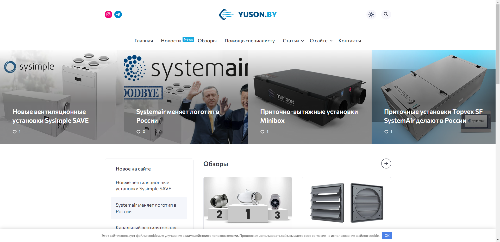
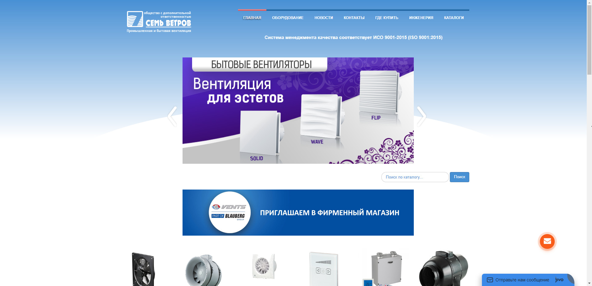
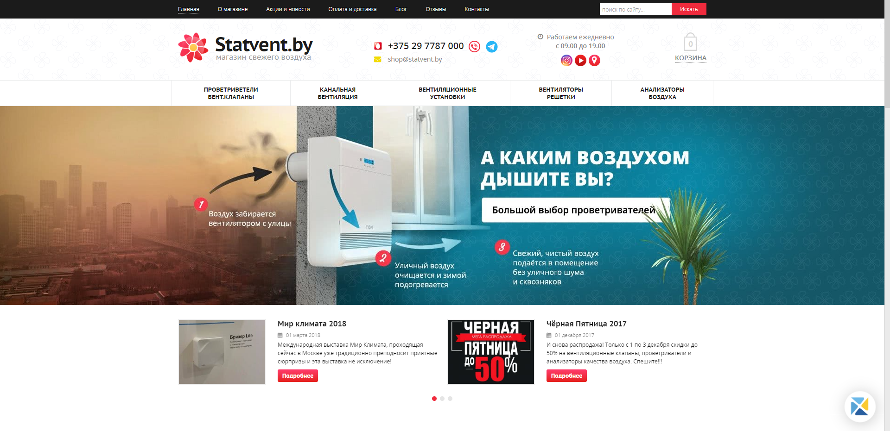
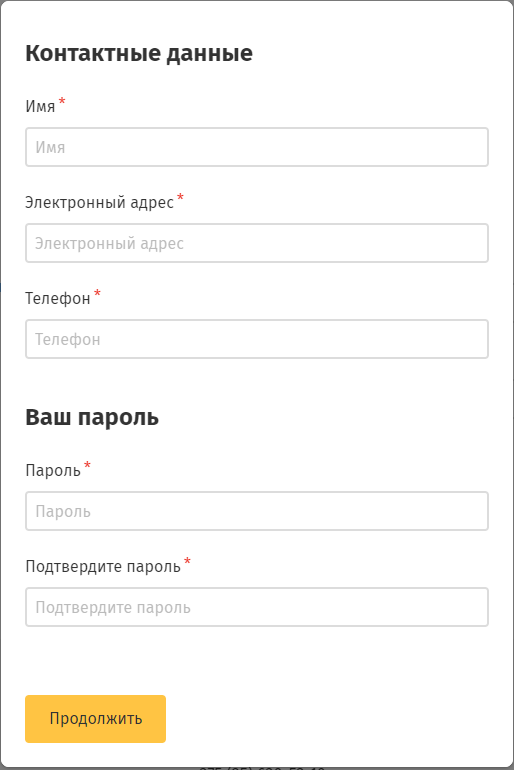
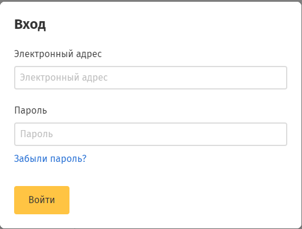
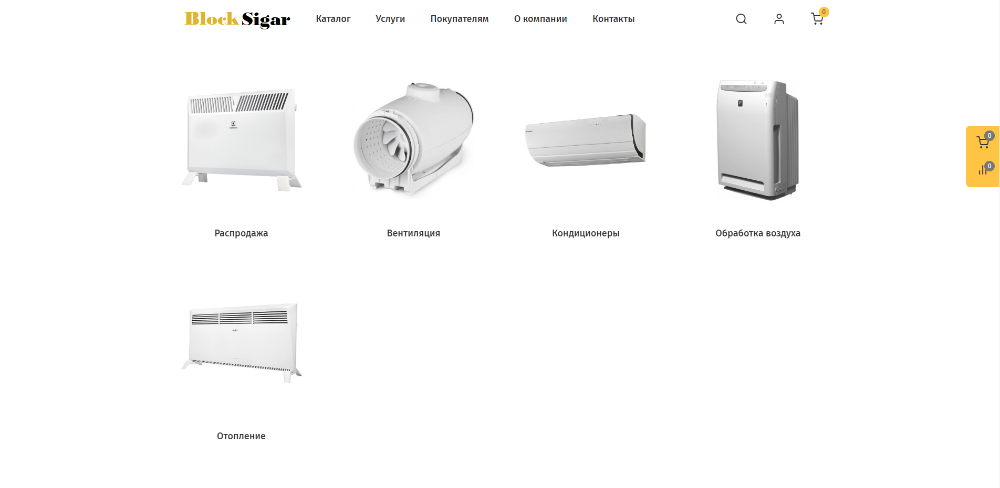

# Интернет-магазин BlockSigar
В папке documents находятся требования к проекту и мокапы в формате pdf.
---

# Содержание

1. [Введение](#intro)  
   1.1 [Назначение](#appointment)  
   1.2 [Бизнес-требования](#business_requirements)  
   1.2.1 [Исходные данные](#initial_data)  
   1.2.2 [Возможности бизнеса](#business_opportunities)  
   1.2.3 [Границы проекта](#project_boundary)  
   1.3 [Аналоги](#analogues)  
   1.3.1 [ЮСОН](#yuson)  
   1.3.2 [Семь ветров](#7_vetrov)  
   1.3.3 [Statvent](#statvent)
2. [Требования пользователя](#user_requirements)  
   2.1 [Программные интерфейсы](#software_interfaces)  
   2.2 [Интерфейс пользователя](#user_interface)  
   2.3 [Характеристики пользователей](#user_specifications)  
   2.3.1 [Классы пользователей](#user_classes)  
   2.3.2 [Аудитория приложения](#application_audience)  
   2.3.2.1 [Целевая аудитория](#target_audience)  
   2.3.2.1 [Побочная аудитория](#collateral_audience)  
   2.4 [Предположения и зависимости](#assumptions_and_dependencies)
3. [Системные требования](#system_requirements)  
   3.1 [Функциональные требования](#functional_requirements)  
   3.1.1 [Основные функции](#main_functions)  
   3.1.1.1 [Вход пользователя в приложение](#user_login_to_the_application)  
   3.1.1.2 [Настройка профиля активного пользователя](#setting_up_the_profile_of_the_active_user)  
   3.1.1.3 [Добавление записей](#add_notation)  
   3.1.1.4 [Выход пользователя из учётной записи](#active_user_change)   
   3.1.2 [Ограничения и исключения](#restrictions_and_exclusions)  
   3.2 [Нефункциональные требования](#non-functional_requirements)  
   3.2.1 [Атрибуты качества](#quality_attributes)  
   3.2.1.1 [Требования к удобству использования](#requirements_for_ease_of_use)  
   3.2.1.2 [Требования к безопасности](#security_requirements)  
   3.2.1.3 [Требования к производительности](#performance_requirements)  
   3.2.2 [Внешние интерфейсы](#external_interfaces)  
   3.2.3 [Ограничения](#restrictions)

# 1 Введение

## 1.1 Назначение

Веб-приложение "BlockSigar" - это онлайн-платформа, предлагающая широкий ассортимент вентиляционного оборудования
для различных целей и типов помещений. Магазин предлагает качественные и надежные продукты от ведущих производителей вентиляционной техники.

<a name="business_requirements"/>

## 1.2 Бизнес-требования

<a name="initial_data"/>

### 1.2.1 Исходные данные

BlockSigar предлагает большой выбор вентиляционного оборудования различных типов и моделей, чтобы удовлетворить потребности клиентов с разными требованиями.
Все продукты в магазине отбираются у проверенных производителей, известных своим качеством и надежностью.
Интернет-магазин позволяет ознакомиться с продукцией, сравнить характеристики и цены, а также оформить заказ онлайн, сэкономив время и усилия.

<a name="business_opportunities"/>

### 1.2.2 Возможности бизнеса

Помимо продажи оборудования, магазин может предлагать услуги проектирования и консультирования в области вентиляции.
Это может включать разработку проектов вентиляционных систем для клиентов, проведение аудита качества воздуха в помещениях или предоставление экспертных рекомендаций по оптимизации систем вентиляции.
Магазин может рассмотреть возможность добавления новых категорий продуктов, таких как системы кондиционирования, оборудование для очистки воздуха или системы увлажнения.
Это позволит привлечь новых клиентов и удовлетворить разнообразные потребности вентиляционной индустрии.

<a name="project_boundary"/>

### 1.2.3 Границы проекта

Веб-приложение для клиента позволяет выбирать и заказывать вентиляционные системы и нужные для них товары. А в функционал администратора входит создание,
изменение и удаление товаров, обработка заказов.

<a name="analogues"/>

## 1.3 Аналоги

<a name="yuson"/>

### 1.3.1 ЮСОН

**Русский интерфейс:** есть  
**Цена:** бесплатный  
**Ссылка на сайт производителя:** https://www.yuson.by

Окно ЮСОН  
  
Компания ЮСОН занимается поставкой в Республику Беларусь оборудования для систем вентиляции и кондиционирования воздуха. Основной профиль деятельности - дистрибуция, оптовая торговля, инжиниринг, техническая поддержка продаж приточных, вытяжных и приточно-вытяжных вентиляционных систем, вентиляторов, калориферов, воздуховодов и другого различного вентиляционного оборудования. "ООО “Компания ЮСОН” занимается оптовой торговлей вентиляционным (климатическим) оборудованием и является официальным представителем (дистрибьютором) компании SALDA в Республике Беларусь.

<a name="7_vetrov"/>

## 1.3.2 Семь Ветров

**Русский интерфейс:** есть  
**Цена:** бесплатный  
**Ссылка на сайт производителя:** https://www.7vetrov.by

Окно Семь ветров.  

ОДО «СЕМЬ ВЕТРОВ» является эксклюзивным дистрибьютором широко известного в Европе производителя вентиляционного оборудования ЧАО «Вентиляционные системы» (Украина), являющегося частью большой  европейской производственной группы Blauberg Group. Группа компаний разрабатывает и производит свои изделия на 7 европейских заводах, расположенных в таких странах, как Германия, Польша, Украина и Россия, а это более 10 000 наименований: бытовые и промышленные вентиляторы, регуляторы скорости,  приточно-вытяжные установки, децентрализованные системы вентиляции, воздушно-отопительные агрегаты и дестратификаторы, воздуховоды, соединительно-монтажные элементы, анемостаты, вентиляционные решетки, ревизионные дверцы и другие элементы систем вентиляции, которые используются для бытовых, офисных, коммерческих и промышленных помещений.

<a name="statvent"/>

## 1.3.3 Statvent

**Русский интерфейс:** есть  
**Цена:** бесплатный  
**Ссылка на сайт производителя:** https://statvent.by

Окно Statvent.  

Statvent.by - это магазин, специализирующийся на продаже свежего воздуха и вентиляционных систем. Они предлагают широкий выбор проветривателей, вентиляционных клапанов, расходных материалов и других товаров, связанных с обеспечением чистого и свежего воздуха в помещениях. В магазине представлены канальные вентиляторы, шумоглушители, регуляторы, обратные клапаны и другие компоненты систем вентиляции. Вы можете выбрать подходящие компоненты для создания или модернизации системы вентиляции в вашем помещении.
Благодаря широкому ассортименту продукции и удобным условиям покупки, магазин предлагает решения для обеспечения чистого и свежего воздуха в вашем доме или офисе.

<a name="comparison_of_applications"/>

<a name="user_requirements"/>

# 2 Требования пользователя

<a name="software_interfaces"/>

## 2.1 Программные интерфейсы

Составляющие проекта:
Хранение данных будет реализовано в SQL таблицах, где будет информация о пользователях и товарах. Серверная часть будет
реализовывать главную логику приложения, работать с базой данных через SQL запросы. Язык написания: Java и фреймворк
Spring. Клиентская часть будет реализовывать функционал backend приложения посредством вызова API методов. Язык
написания: JavaScript фреймворк - React.

<a name="user_interface"/>

## 2.2 Интерфейс пользователя

Окно регистрации нового пользователя.  

При нажатии на кнопку "Продолжить" - переход к только что созданному профилю, если введены все поля.   
Окно входа уже зарегистрированного пользователя.

При нажатии на кнопку "Войти" - переход на страницу своего профиля, если введены все поля.   
При нажатии на кнопку "Забыли пароль?" - осуществляется переход на страницу восстановления пароля.  
Главное окно веб-приложения.  

При нажатии на кнопку "Каталог" - веб-приложение показывает некоторые варианты нужного оборудования.  
При нажатии на кнопку "Услуги" - веб-приложение показывает некоторые варианты услуг, которые предоставляет компания.  
При нажатии на кнопку "Покупателям" - веб-приложение показывает информацию, которая может понадобится потенциальным покупателям при выборе оборудования.  
При нажатии на кнопку "О компании" - веб-приложение показывает информацию о компании.  
При нажатии на кнопку "Контакты" - появляется окно, где показываются контактные данные компании.  
При нажатии на кнопку "Поиск" - в веб-приложении появляется новый элемент окна с возможностью ввода названия обуви для поиска.  
При нажатии на кнопку "Профиль" - веб-приложение переходит в окно с профилем, если пользователь уже авторизован, или в окно со входом и регистрации, если пользователь еще не авторизован или у него нет учетной записи.  
При нажатии на кнопку "Корзина" - веб-приложение переходит в окно с корзиной.  
При нажатии на кнопку "Сравнение" - веб-приложение переходит в окно, где сравниваются товары, добавленные ранее в каталоге.  

<a name="user_specifications"/>

## 2.3 Характеристики пользователей

<a name="user_classes"/>

### 2.3.1 Классы пользователей

| Класс пользователей             | Описание                                                                                                                                                                                                |
|:--------------------------------|:--------------------------------------------------------------------------------------------------------------------------------------------------------------------------------------------------------|
| Зарегистрированные пользователи | Пользователи, которые вошли в приложение под своей электронной почтой, желающие просматривать модели вентиляционных систем, делать заказ. Имеют доступ к ограниченному функционалу                                      |
 | Администратор                   | Пользователи, которые вошли в приложение под своей электронной почтой, желающие просматривать модели вентиляторов, делать заказ, добавлять, изменять, удалять вентиляционных систем. Имеют доступ к полному функционалу |

<a name="application_audience"/>

### 2.3.2 Аудитория приложения

<a name="target_audience"/>

#### 2.3.2.1 Целевая аудитория

Компании, специализирующиеся на данной продукции и люди старшей возрастных категорий.

<a name="collateral_audience"/>

#### 2.3.2.2 Побочная аудитория

Люди младшей и средней возрастных категорий.

<a name="assumptions_and_dependencies"/>

## 2.4 Предположения и зависимости

Веб-приложение работает некорректно при большом количестве запросов к нему за определенный промежуток времени.

<a name="system_requirements"/>

# 3 Системные требования

<a name="functional_requirements"/>

## 3.1 Функциональные требования

<a name="main_functions"/>

### 3.1.1 Основные функции

<a name="user_login_to_the_application"/>

#### 3.1.1.1 Вход пользователя в приложение

**Описание.** Пользователь имеет возможность использовать ограниченный набор инструкций веб-приложения без вхождения в
свою учётную запись. Например: просмотр ассортимента товаров.

| Функция | Требования                                                                                                                                                                                                                           | 
|:---|:-------------------------------------------------------------------------------------------------------------------------------------------------------------------------------------------------------------------------------------|
| Регистрация нового пользователя | Приложение должно запросить у пользователя ввести электронную почту и пароль для создания учётной записи. Пользователь должен ввести электронную почту и пароль.                                                                     |
| Вход зарегистрированного пользователя в приложение | Приложение запрашивает у пользователя ввести электронную почту и пароль, проверка правильности данных происходит на серверной части приложения, после успешной аутентификации пользователь перенаправляется на страницу его профиля. |

<a name="setting_up_the_profile_of_the_active_user"/>

#### 3.1.1.2 Настройка профиля активного пользователя

**Описание.** Зарегистрированный пользователь имеет возможность редактировать своё имя и пароль.

| Функция | Требования | 
|:---|:---|
| Изменение имени пользователя | Приложение должно запросить ввести новое имя а также пароль для подтверждения действия. Если выбранное имя уже существует, приложение предоставит возможность повторного ввода |
| Изменение пароля | Зарегистрированный пользователь имеет возможножность изменить пароль, при этом приложение запрашивает ввести старый пароль для подтверждения личности |

<a name="add_notation"/>

#### 3.1.1.3 Действия над товарами

**Описание.** После авторизации пользователя и проверки его роли админстратора. Администратором возможно добавление
товаров, их редактирование и удаление.

| Функция               | Требования                                                                                                                                                        | 
|:----------------------|:------------------------------------------------------------------------------------------------------------------------------------------------------------------|
| Добавление товара     | Веб-приложение создает товар, предоставив администратору бланк заполнения товара, в котором указана бренд, марка, размер, цвет, артикул, цена и фотографии товара |
| Редактирование товара | Веб-приложение предоставляет доступ к уже созданному товару, для его изменения                                                                                    |
| Удаление товара       | Веб-приложение удаляет созданный товар по введённой артиклу                                                                                                       |
| Поиск товара          | Веб-приложение предоставляет поиск товаров по их марке                                                                                                            |

<a name="active_user_change"/>

#### 3.1.1.4 Выход зарегистрированного пользователя из учётной записи

**Описание.** Зарегистрированный пользователь имеет возможность выйти из учётной записи.

**Требование.** Веб-приложение должно предоставить зарегистрированному пользователю возможность выйти из учётной записи
с возвратом к главному окну в веб-приложении.

<a name="restrictions_and_exclusions"/>

### 3.1.2 Ограничения и исключения

1. Веб-приложение работает корректно только при хорошем Интернет-соединении;
2. Отсутствует возможность заказывать товар, не имея учётной записи.

<a name="non-functional_requirements"/>

## 3.2 Нефункциональные требования

<a name="quality_attributes"/>

### 3.2.1 Атрибуты качества

<a name="requirements_for_ease_of_use"/>

#### 3.2.1.1 Требования к удобству использования

1. Доступ к основным функциям веб-приложения не более чем за одну операцию;
2. Все функциональные элементы пользовательского интерфейса имеют названия, описывающие действие, которое произойдет при
   выборе элемента;
3. Пошаговая инструкция использования основных функций приложения отображена в справке.

<a name="security_requirements"/>

#### 3.2.1.2 Требования к безопасности

Веб-приложение предоставляет возможность просмотра и редактирования профиля только авторизированному пользователю.

<a name="external_interfaces"/>

### 3.2.2 Внешние интерфейсы

Окна веб-приложения удобны для использования пользователями с плохим зрением:

* размер шрифта не менее 14пт;
* функциональные элементы контрастны фону окна.

<a name="restrictions"/>

### 3.2.3 Ограничения

1. Приложение реализовано на платформе Spring Framework;
2. Все записи хранятся в базе данных PostgreSQL.
