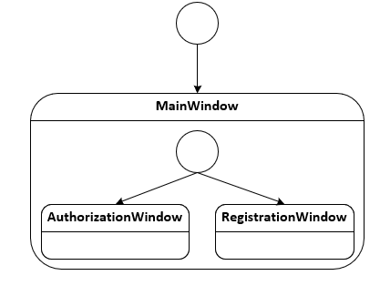
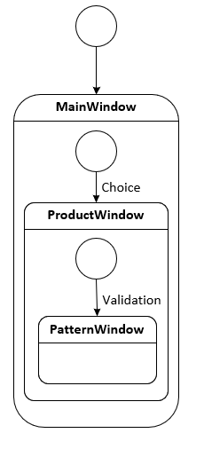
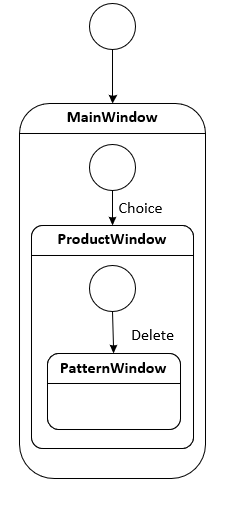
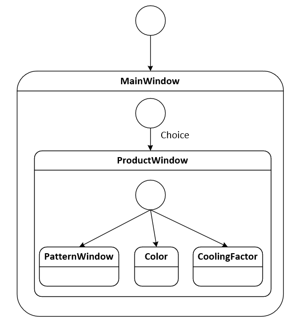
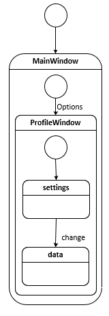

# Диаграммы состояния
---

# Содержание
1. [Авторизация в приложении](#1)
2. [Добавление товара](#2)
3. [Удаление товара](#3)
4. [Просмотр товара](#4)
5. [Редактирование профиля](#5)

### 1. Авторизация в приложении

### 2. Добавление товара

  
### 3. Удаление товара

### 4. Просмотр товара

### 5. Настройка профиля

